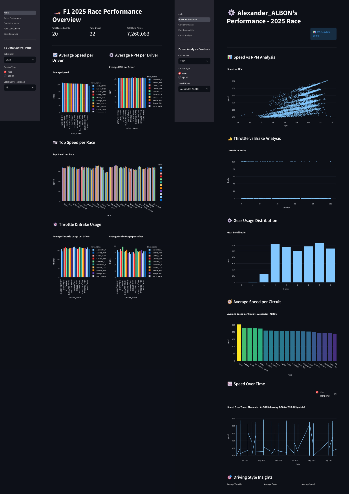
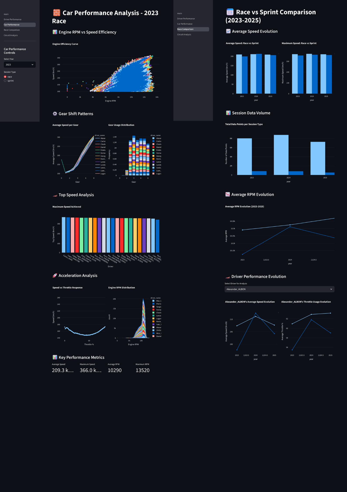
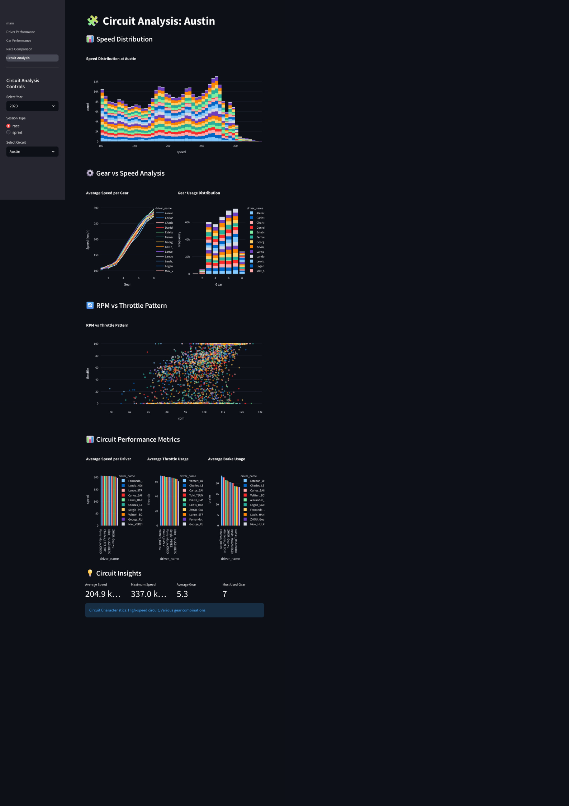

# F1 Performance Dashboard

[](https://opensource.org/licenses/MIT)
[](https://www.python.org/downloads/)
[](https://streamlit.io)

A Streamlit-based interactive dashboard to analyze Formula 1 performance by driver, car/engine, and circuit, plus race vs sprint comparisons (2023–2025). It visualizes key telemetry-style metrics such as speed, RPM, throttle, brake, and gear usage patterns.

**Important:** The dataset is not bundled with this repository. The app reads CSV files from a local folder named `f1_cleaned_data/` that you provide.

## Before You Run (Get the Data First)

You must have data available under `f1_cleaned_data/` before launching the app. Choose ONE of the following:

**Option A — Download ready-to-use dataset:**

- 📥 [Download from Google Drive](https://drive.google.com/drive/folders/195xYOXAbZBYR-XWG4yqnA7Wl-vTjTbe3?usp=sharing)
- After download, extract/place the `f1_cleaned_data/` folder at the project root (same level as `main.py`).

**Option B — Scrape/build the data yourself:**

- Open the notebook at `data_scraping/Collab/Data_scraping.ipynb` and follow the steps to collect and export CSVs.
- Save your outputs into the folder structure shown below (`f1_cleaned_data/<YEAR>/<race|sprint>/*.csv`).

## Supported Data Layout

Place your CSVs like this (rooted at the project directory):

```
f1_cleaned_data/
  └─ <YEAR>/
      ├─ race/
      │   ├─ <any_name_1>.csv
      │   └─ <any_name_2>.csv
      └─ sprint/
          ├─ <any_name_3>.csv
          └─ <any_name_4>.csv
```

Recommended columns (the app adapts if some are missing):

- Common: `driver_name`, `speed`, `rpm`, `throttle`, `brake`, `n_gear`
- Helpful for extra analytics: `race` (circuit name), `lap`, `date`

Example CSV row (short header):

```
driver_name,speed,rpm,throttle,brake,n_gear,race,lap,date
Max Verstappen,312.4,11800,78.2,0.0,8,Monza,12,2024-09-01T13:24:51Z
```

If a column is missing, related charts will be hidden automatically.

## Features

- Overview with global performance metrics and filters (year, session type, driver).
- Driver analysis: speed vs RPM, throttle vs brake, gear distribution, lap/time speed trends.
- Car/engine analysis: RPM vs speed efficiency, gear shift patterns and distribution, top speed.
- Circuit analysis: speed distribution, gear patterns, RPM vs throttle, circuit characteristics.
- Cross-year comparison (2023–2025): race vs sprint average/max speed, RPM trends.
- Performance helpers: data caching, sampling to keep the browser smooth, sidebar performance metrics.

## Project Structure

```
F1 Performance Dashboard/
├─ main.py                    # Main overview page
├─ pages/                     # Streamlit multipage screens
│  ├─ 1_Driver_Performance.py
│  ├─ 2_Car_Performance.py
│  ├─ 3_Race_Comparison.py
│  └─ 4_Circuit_Analysis.py
├─ utils.py                   # Data loaders, chart helpers
├─ performance_monitor.py     # Sidebar performance metrics
├─ assets/                    # Screenshots for README/UI
├─ data_scraping/             # Scraping notebook (optional)
├─ requirements.txt           # Python dependencies
└─ f1_cleaned_data/           # (You provide) per-year/session CSVs
```

## Prerequisites

- Python 3.9+
- Git (download from [git-scm.com](https://git-scm.com/download/win))
- OS: Windows (commands below use Command Prompt / cmd.exe)

## Quick Start

### 1. Clone the Repository

Clone this repository to your local machine:

```bash
git clone https://github.com/YOUR_USERNAME/F1-Performance-Dashboard.git
cd F1-Performance-Dashboard
```

> **Note:** Replace `YOUR_USERNAME` with the actual repository owner, or if you're viewing this on GitHub, click the green **Code** button above and copy the HTTPS/SSH URL.

### 2. Get the Data

Download the dataset from [Google Drive](https://drive.google.com/drive/folders/195xYOXAbZBYR-XWG4yqnA7Wl-vTjTbe3?usp=sharing) and extract the `f1_cleaned_data/` folder to the project root.

Or scrape it yourself using the notebook at `data_scraping/Collab/Data_scraping.ipynb`.

### 3. Install Dependencies

**PowerShell:**

```powershell
python -m venv .venv
.venv\Scripts\Activate.ps1
pip install -r requirements.txt
```

**Command Prompt (cmd):**

```bat
python -m venv .venv
.venv\Scripts\activate
pip install -r requirements.txt
```

If `python` is not recognized, try `py` instead of `python`.

### 4. Run the Dashboard

```bat
streamlit run main.py
```

The app will open in your browser at http://localhost:8501

## Screenshots

| Overview                | Driver Analysis       | Circuit Analysis       |
| ----------------------- | --------------------- | ---------------------- |
|  |  |  |

## How It Works (Quick)

- `utils.py`
  - `load_data(...)`, `load_data_filtered(...)` read CSVs and cache results (`@st.cache_data`).
  - `get_available_years/circuits/drivers` scan directories/sample CSVs to populate dynamic filters.
  - Chart helpers like `create_average_speed_bar`, `create_speed_rpm_scatter`, etc.
- `main.py` shows overview metrics and general charts.
- `pages/` contains Streamlit multipage screens (ordered by numeric prefixes).
- `performance_monitor.py` adds optional sidebar performance metrics.

## License

This project is licensed under the MIT License - see the [LICENSE](LICENSE) file for details.

## Contributing

Contributions are welcome! To add a new page/feature:

1. Fork this repo
2. Create a feature branch: `git checkout -b feature/amazing-feature`
3. Add your page under `pages/` (use numeric prefix for ordering, e.g., `5_New_Analysis.py`)
4. Commit changes: `git commit -m "Add amazing feature"`
5. Push to your fork: `git push origin feature/amazing-feature`
6. Open a Pull Request

## Credits

Built with:

- [Streamlit](https://streamlit.io/) - Interactive web apps for data science
- [Pandas](https://pandas.pydata.org/) & [NumPy](https://numpy.org/) - Data manipulation
- [Plotly](https://plotly.com/python/) - Interactive charts

## Repository

- GitHub: [jejow/F1-Performance-Dashboard](https://github.com/jejow/F1-Performance-Dashboard)
- Issues: [Report bugs or request features](https://github.com/jejow/F1-Performance-Dashboard/issues)

---

Made with ❤️ for F1 fans
